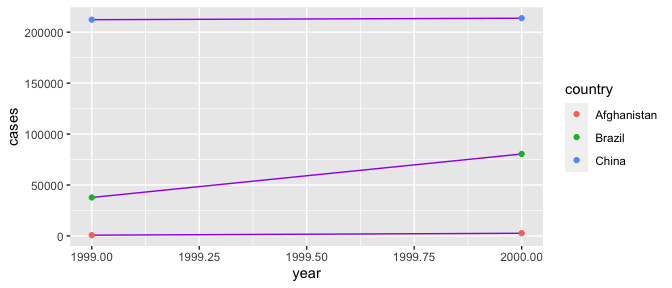
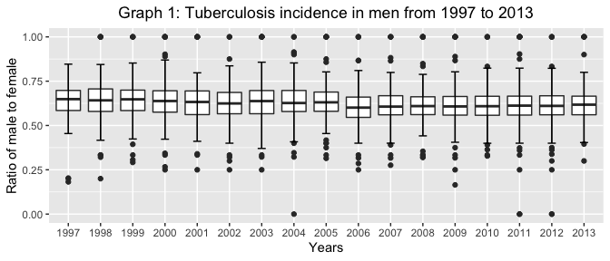
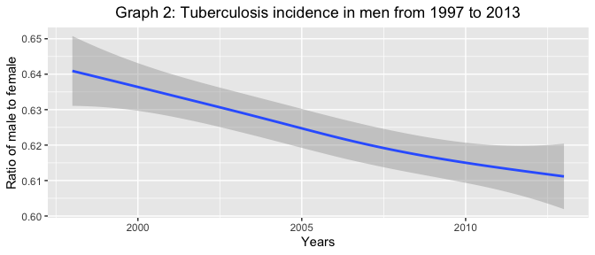
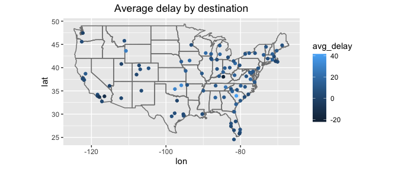
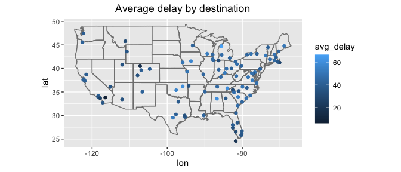
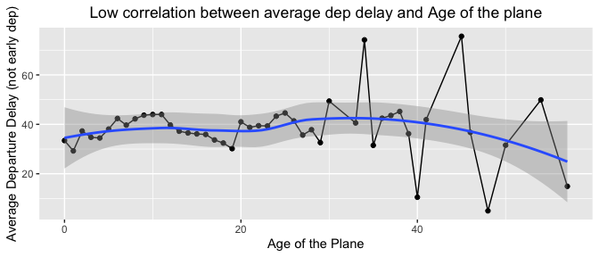
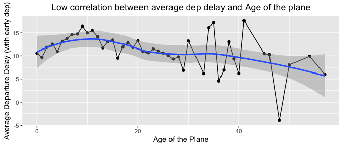
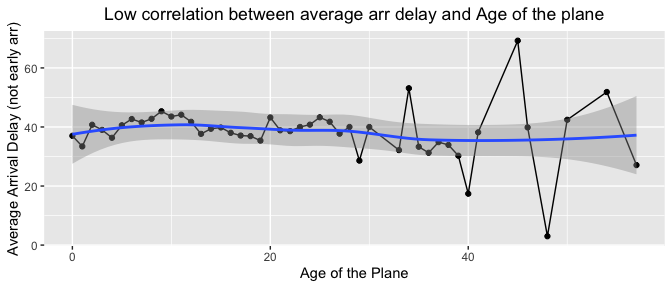

Add your initials to indicate your agreement: **KEZG**

Add names of anyone you discussed this problem set with: **KEZG**

Late coins used this pset: 0. Late coins left after submission: X.

    library(ggplot2)

# Tidy data with pivot\_wider() and pivot\_longer() (25 points)

**1. Load library(tidyverse) and look at table1, table2, table4a and
table4b (these tables are included with tidyverse). ?table1 will bring
up information about all the tables. The data about country, year, and
cases are identical in the tables, but presented in different formats.
Use each table to calculate the cases of tuberculosis per 10,000 people
(this is the TB rate).**

I’m assuming that it has to show the information from the four tables in
the same way, so we’ll get the same outcomes.

    library(tidyverse)
    ?table1

-   Looking at table1

<!-- -->

    view(table1) # we use 'view' because I don't want the table to be printed on the screen

-   Calculating tuberculosis rate using Table1:

<!-- -->

    table1 %>%
      mutate(TB_rate = cases / population * 10000) %>%
      select(country, year, TB_rate) %>%
      pivot_wider(names_from = year, values_from = TB_rate)

    ## # A tibble: 3 × 3
    ##   country     `1999` `2000`
    ##   <chr>        <dbl>  <dbl>
    ## 1 Afghanistan  0.373   1.29
    ## 2 Brazil       2.19    4.61
    ## 3 China        1.67    1.67

-   Looking at table2

<!-- -->

    view(table2) # we use 'view' because I don't want the table to be printed on the screen

-   Calculating tuberculosis rate using Table2:

<!-- -->

    table2 %>%
      pivot_wider(names_from = type, values_from = count) %>%
      mutate(TB_rate = cases / population * 10000) %>%
      select(country, year, TB_rate) %>%
      pivot_wider(names_from = year, values_from = TB_rate)

    ## # A tibble: 3 × 3
    ##   country     `1999` `2000`
    ##   <chr>        <dbl>  <dbl>
    ## 1 Afghanistan  0.373   1.29
    ## 2 Brazil       2.19    4.61
    ## 3 China        1.67    1.67

-   Looking at table4a and table4b

<!-- -->

    view(table4a)
    view(table4b)

-   Calculating tuberculosis rate using Table4a and Table4b:

<!-- -->

    table_cases <- table4a %>%
      pivot_longer(
        cols = "1999":"2000",
        names_to = "year",
        values_to = "cases"
      )

    table4b %>%
      pivot_longer(
        cols = "1999":"2000",
        names_to = "year",
        values_to = "population"
      ) %>%
      inner_join(table_cases,
        by = c("country", "year")
      ) %>%
      mutate(TB_rate = cases / population * 10000) %>%
      select(country, year, TB_rate) %>%
      pivot_wider(
        names_from = year,
        values_from = TB_rate
      )

    ## # A tibble: 3 × 3
    ##   country     `1999` `2000`
    ##   <chr>        <dbl>  <dbl>
    ## 1 Afghanistan  0.373   1.29
    ## 2 Brazil       2.19    4.61
    ## 3 China        1.67    1.67

**Which table is easier to work with? Which is harder? Why?**

Table 1 was easier or the most user-friendly, with distinct columns for
nation, year, cases, and population. All I had to do was add (mutate) a
new column for the TB rate.

Tables 4a and 4b were harder or more challenging to deal with since they
show divided data (cases and population variables appear in distinct
tables); I had to merge the data and then find the TB rate.

I decided to show the same output (same presentation) for all three
scenarios.

**2. Recreate the plot from the textbook (section 12.2) showing change
in cases over time using table2 instead of table1. What do you need to
do first?**

Since one observation is in multiple rows, I need to do a transformation
of the table, using pivot\_wider() putting the variable ‘type’ into
columns.

    table2 %>%
      pivot_wider(names_from = type, values_from = count) %>%
      ggplot(aes(year, cases)) +
      geom_line(aes(group = country), colour = "purple") +
      geom_point(aes(colour = country))

**3. pivot\_wider() and pivot\_longer() are not perfectly symmetrical.
Carefully consider the following example.**

    stocks <- tibble(
      year = c(2015, 2015, 2016, 2016),
      half = c(1, 2, 1, 2),
      return = c(1.88, 0.59, 0.92, 0.17)
    )
    stocks

    ## # A tibble: 4 × 3
    ##    year  half return
    ##   <dbl> <dbl>  <dbl>
    ## 1  2015     1   1.88
    ## 2  2015     2   0.59
    ## 3  2016     1   0.92
    ## 4  2016     2   0.17

**When we want to reshape stock, why do we need quotes on the arguments
names\_to and values\_to, but not names\_from and values\_from?**

    stocks %>%
      pivot_wider(names_from = year, values_from = return)

    ## # A tibble: 2 × 3
    ##    half `2015` `2016`
    ##   <dbl>  <dbl>  <dbl>
    ## 1     1   1.88   0.92
    ## 2     2   0.59   0.17

    stocks %>%
      pivot_wider(names_from = year, values_from = return) %>%
      pivot_longer(`2015`:`2016`, names_to = "year", values_to = "return")

    ## # A tibble: 4 × 3
    ##    half year  return
    ##   <dbl> <chr>  <dbl>
    ## 1     1 2015    1.88
    ## 2     1 2016    0.92
    ## 3     2 2015    0.59
    ## 4     2 2016    0.17

They both have different functions, names\_to and values\_to need quotes
because they are specifying the name of the new columns from the stored
data that are column names (character) or values (numeric). Therefore,
since they are string they need quotes. However, names\_from and
values\_from specify from which column R should get the output column
names (names\_from) or cell values (values\_from).

Also, the pivot\_wider function generates column names from column
values, thus in this example, the “year” column values are now column
names and are regarded as characters, i.e. the year now has a character
data type rather than a numeric data type. In that sense, when we use
pivot\_longer, the column “names\_to” created from the column names will
be character by default and therefore we we will need to use quotes.

**4. Your fellow student shows you this code which fails. They would
like to post a reproducible example of the code failing on Ed, but they
need your help. Use the function reprex from the package also called
reprex to produce a reproducible example of both the code which fails
and the output it produces when it fails.**

    library(reprex)

    reprex::reprex(table4a %>% pivot_longer(1999:2000, names_to = "year", values_to = "cases"))

    ## ℹ Non-interactive session, setting `html_preview = FALSE`.

    ## ℹ Rendering reprex...

    ## CLIPR_ALLOW has not been set, so clipr will not run interactively

**5. Now, explain the error message. How could it be fixed?**

The quotation marks of the columns 1999 and 2000 are missing, since they
are the name of the columns, R understand them as a character, so we
need to use quotation marks.

Similarly, as we explained before, the “year” column values are column
names and are regarded as character, i.e. the year now has a character
data type rather than a numeric data type so we need to use quotes.

    table4a %>% pivot_longer("1999":"2000", names_to = "year", values_to = "cases")

    ## # A tibble: 6 × 3
    ##   country     year   cases
    ##   <chr>       <chr>  <int>
    ## 1 Afghanistan 1999     745
    ## 2 Afghanistan 2000    2666
    ## 3 Brazil      1999   37737
    ## 4 Brazil      2000   80488
    ## 5 China       1999  212258
    ## 6 China       2000  213766

**6. Why does pivot\_wider fail on this tibble? Add a new column to
address the problem and show that pivot\_wider works on your new updated
dataset.**

    people <- tribble(
      ~name, ~key, ~value,
      #-----------------|--------|------
      "Phillip Woods", "age", 45,
      "Phillip Woods", "height", 186,
      "Phillip Woods", "age", 50,
      "Phillip Woods", "height", 185,
      "Jessica Cordero", "age", 37,
      "Jessica Cordero", "height", 156
    )
    people

    ## # A tibble: 6 × 3
    ##   name            key    value
    ##   <chr>           <chr>  <dbl>
    ## 1 Phillip Woods   age       45
    ## 2 Phillip Woods   height   186
    ## 3 Phillip Woods   age       50
    ## 4 Phillip Woods   height   185
    ## 5 Jessica Cordero age       37
    ## 6 Jessica Cordero height   156

-   Pivot\_wider fails on this tibble

Pivot\_wider fails because the argument values\_from do not uniquely
identify a single row. In this tibble, Phillip Woods have two values for
“age” and for “height”.

    people %>%
      pivot_wider(
        names_from = key,
        values_from = value
      )

    ## # A tibble: 2 × 3
    ##   name            age       height   
    ##   <chr>           <list>    <list>   
    ## 1 Phillip Woods   <dbl [2]> <dbl [2]>
    ## 2 Jessica Cordero <dbl [1]> <dbl [1]>

-   We can address the problem by adding a row for every distinct
    observation (primary key). Thus we have to group by name and key.

<!-- -->

    people %>%
      group_by(name, key) %>%
      mutate(distinct_obs = row_number()) %>%
      pivot_wider(
        names_from = name,
        values_from = value
      ) %>%
      select(!distinct_obs)

    ## # A tibble: 4 × 3
    ## # Groups:   key [2]
    ##   key    `Phillip Woods` `Jessica Cordero`
    ##   <chr>            <dbl>             <dbl>
    ## 1 age                 45                37
    ## 2 height             186               156
    ## 3 age                 50                NA
    ## 4 height             185                NA

**7. Tidy the pivot table below. Do you need to make it wider or longer?
What are the variables?**

    preg <- tribble(
      ~pregnant, ~male, ~female,
      "yes", NA, 10,
      "no", 20, 12
    )

    preg

    ## # A tibble: 2 × 3
    ##   pregnant  male female
    ##   <chr>    <dbl>  <dbl>
    ## 1 yes         NA     10
    ## 2 no          20     12

-   To make it tidy, we have used pivot\_longer and discarded the NA
    value. The variables we have used are Pregnant, Sex and total.

<!-- -->

    preg %>%
      pivot_longer("male":"female",
        names_to = "Sex", values_to = "Total",
        values_drop_na = TRUE
      )

    ## # A tibble: 3 × 3
    ##   pregnant Sex    Total
    ##   <chr>    <chr>  <dbl>
    ## 1 yes      female    10
    ## 2 no       male      20
    ## 3 no       female    12

-   Likewise, another tidy version could be the following, where I put 1
    if the person is a female, and also 1 if the female is pregnant.

<!-- -->

    preg %>%
      pivot_longer("male":"female",
        names_to = "Sex", values_to = "Total",
        values_drop_na = TRUE
      ) %>%
      mutate(
        Pregnant = ifelse(pregnant == "yes", 1, 0),
        Female = (ifelse(Sex == "female", 1, 0))
      ) %>%
      select(Female, Pregnant, Total)

    ## # A tibble: 3 × 3
    ##   Female Pregnant Total
    ##    <dbl>    <dbl> <dbl>
    ## 1      1        1    10
    ## 2      0        0    20
    ## 3      1        0    12

**8. What do the extra and fill arguments do in separate()? (Hint:
Experiment with the various options for the following two toy
datasets.)**

-   The argument “extra” is used when here are too many values in the
    data. There are three options “warn”, “drop” and “merge”.

As for “warn”, it emits a result very similar to omitting the extra
argument (it emits a warning and drop extra values).

    tibble(x = c("a,b,c", "d,e,f,g", "h,i,j")) %>%
      separate(x, c("one", "two", "three"), extra = "warn")

    ## Warning: Expected 3 pieces. Additional pieces discarded in 1 rows [2].

    ## # A tibble: 3 × 3
    ##   one   two   three
    ##   <chr> <chr> <chr>
    ## 1 a     b     c    
    ## 2 d     e     f    
    ## 3 h     i     j

As for “drop”, it discards the extra value and does not issue the
warning.

    tibble(x = c("a,b,c", "d,e,f,g", "h,i,j")) %>%
      separate(x, c("one", "two", "three"), extra = "drop")

    ## # A tibble: 3 × 3
    ##   one   two   three
    ##   <chr> <chr> <chr>
    ## 1 a     b     c    
    ## 2 d     e     f    
    ## 3 h     i     j

Finally, the “merge” option causes the values in the last column to be
merged, now appearing together “f,g”.

    tibble(x = c("a,b,c", "d,e,f,g", "h,i,j")) %>%
      separate(x, c("one", "two", "three"), extra = "merge")

    ## # A tibble: 3 × 3
    ##   one   two   three
    ##   <chr> <chr> <chr>
    ## 1 a     b     c    
    ## 2 d     e     f,g  
    ## 3 h     i     j

-   The fill argument is used when there are not enough values in the
    data. There are three options “warn”, “right” and “left”.

As for “warn”, it emits a result very similar to omitting the fill
argument (it emits a warning and fill columns with missing values).

    tibble(x = c("a,b,c", "d,e", "f,g,i")) %>%
      separate(x, c("one", "two", "three"), fill = "warn")

    ## Warning: Expected 3 pieces. Missing pieces filled with `NA` in 1 rows [2].

    ## # A tibble: 3 × 3
    ##   one   two   three
    ##   <chr> <chr> <chr>
    ## 1 a     b     c    
    ## 2 d     e     <NA> 
    ## 3 f     g     i

As for “right”, it fill columns from the right with missing values and
does not issue the warning.

    tibble(x = c("a,b,c", "d,e", "f,g,i")) %>%
      separate(x, c("one", "two", "three"), fill = "right")

    ## # A tibble: 3 × 3
    ##   one   two   three
    ##   <chr> <chr> <chr>
    ## 1 a     b     c    
    ## 2 d     e     <NA> 
    ## 3 f     g     i

Finally, the “left” option it fill columns from the left with missing
values and does not issue the warning

    tibble(x = c("a,b,c", "d,e", "f,g,i")) %>%
      separate(x, c("one", "two", "three"), fill = "left")

    ## # A tibble: 3 × 3
    ##   one   two   three
    ##   <chr> <chr> <chr>
    ## 1 a     b     c    
    ## 2 <NA>  d     e    
    ## 3 f     g     i

**9. In the WHO case study in class, we claimed that iso2 and iso3 were
redundant with country. Confirm this claim.**

-   We can show that they are redundant, when we find out what is the
    distinct number of countries in the data set:

<!-- -->

    who %>%
      distinct(country) %>%
      summarise(n())

    ## # A tibble: 1 × 1
    ##   `n()`
    ##   <int>
    ## 1   219

-   At the same time, we will select the variables of interest
    ‘country’, iso2’ and ‘iso3’ grouping them to find how many times
    these combinations are repeated:

<!-- -->

    who %>%
      select(country, iso2, iso3) %>%
      distinct() %>%
      summarise(n())

    ## # A tibble: 1 × 1
    ##   `n()`
    ##   <int>
    ## 1   219

As we will see, the combinations of ‘country’, ‘iso2’ and ‘iso3’, are
the same as when we only have the variable ‘country’.

-   Likewise, when we take the total repeats for ‘country’, ‘iso 2’ and
    ‘iso3’ (column “n”), we find the total number of rows in the initial
    data set.

<!-- -->

    who1 <- who %>%
      group_by(country, iso2, iso3) %>%
      summarise(n = n())

    ## `summarise()` has grouped output by 'country', 'iso2'. You can override using
    ## the `.groups` argument.

    sum(who1$n)

    ## [1] 7240

# tidying case study (35 pts)

**1. In this WHO case study in Ch 12.6 Hadley set na.rm = TRUE just to
make it easier to check that we had the correct values.**

**a. Are there implicit missing values? Use a command you learned in
this lecture (tidy data) to check. If there are implicit missing values,
how many rows? If not, show how you know that there are not.**

-   First, we are going to use the code “complete” to turn implicit
    missing values into explicit.

<!-- -->

    implicit_MV <- who %>%
      complete(country, year) %>%
      summarise(n())

-   There are some implicit missing values since the number of complete
    cases of (country, year) is greater than the number of rows in
    “who”. So, we’ll subtract the number of rows in “who” from the
    number of rows in “implicit\_MV” to get the precise amount of
    implicit missing values.

<!-- -->

    implicit_MV - nrow(who)

    ##   n()
    ## 1 206

There are 206 implicit missing values, that is, combinations that are
not shown in the data set.

**b. How many country-year pairs are explicitly missing TB data?**

    who_longer <- who %>%
      pivot_longer(
        cols = "new_sp_m014":"newrel_f65", names_to = "Groups",
        values_to = "TB_cases"
      )

    who_longer %>%
      filter(is.na(TB_cases)) %>%
      select(country, year, TB_cases) %>%
      group_by(country, year) %>%
      distinct(country, year) %>%
      nrow()

    ## [1] 7240

**2. In this WHO case study in Ch 12.6, what’s the difference between an
NA and zero?**

    who_longer %>%
      filter(TB_cases == 0) %>%
      nrow()

    ## [1] 11080

Since we can directly identify zeros in the data, it appears that zero
TB instances are openly stated using the value zero, as opposed to NA,
which would only be used to indicate missing values (not zeros).

**3. What happens if you neglect the mutate() step? (mutate(key =
stringr::str\_replace(key, “newrel”, “new\_rel”)))**

The column that we have called “Groups” or that in the book is referred
to as “key”, contains information that describes TB disease. In that
sense, the words that follow “new” express:

rel: stands for cases of relapse ep: stands for cases of extrapulmonary
TB sn: stands for cases of pulmonary TB that could not be diagnosed by a
pulmonary smear (smear negative) sp: stands for cases of pulmonary TB
that could be diagnosed by a pulmonary smear (smear positive)

For all cases the word new is separated from the next two letters with
an asterisk below, but this does not happen in the first case “newrel”,
so the data is transformed to make all variable names consistent.

**4. Health outcomes are often sexed. As in certain maladies are more
associated with males or females. Using the tidied WHO data, you will
make an informative visualization to address the question: “To what
extent is Tuberculosis associated with a specific sex and has this
changed from 1997 onward?” Begin with the following queries:**

**a. For each country, year, and sex compute the total number of cases
of TB.**

    who2 <- who %>%
      pivot_longer(
        cols = "new_sp_m014":"newrel_f65", names_to = "Groups",
        values_to = "TB_cases", values_drop_na = TRUE
      ) %>%
      mutate(key = stringr::str_replace(Groups, "newrel", "new_rel")) %>%
      separate(key, c("new", "type", "sexage"), sep = "_") %>%
      separate(sexage, c("sex", "age"), sep = 1) %>%
      select(country, year, sex, age, TB_cases)

    who3 <- who2 %>%
      group_by(country, year, sex) %>%
      summarise(total_by_sex = sum(TB_cases))

    ## `summarise()` has grouped output by 'country', 'year'. You can override using
    ## the `.groups` argument.

    who3

    ## # A tibble: 6,921 × 4
    ## # Groups:   country, year [3,484]
    ##    country      year sex   total_by_sex
    ##    <chr>       <dbl> <chr>        <dbl>
    ##  1 Afghanistan  1997 f              102
    ##  2 Afghanistan  1997 m               26
    ##  3 Afghanistan  1998 f             1207
    ##  4 Afghanistan  1998 m              571
    ##  5 Afghanistan  1999 f              517
    ##  6 Afghanistan  1999 m              228
    ##  7 Afghanistan  2000 f             1751
    ##  8 Afghanistan  2000 m              915
    ##  9 Afghanistan  2001 f             3062
    ## 10 Afghanistan  2001 m             1577
    ## # … with 6,911 more rows

**b. Using raw values is probably not going to provide clear evidence.
Why not?**

No, since it is necessary to transform the data to be analyzed. The
columns from “new\_sp\_m014” to “newrel\_f65” contained a lot of
information (age, sex, type of TB) that needed to be separated for
better analysis.

**c. For each country-year, compute the ratio of male to female
patients.**

    who5 <- who3 %>%
      group_by(country, year) %>%
      mutate(total_by_year = sum(total_by_sex)) %>%
      mutate(ratio_male_female = total_by_sex / total_by_year) %>%
      filter(sex == "m")

    who5 

    ## # A tibble: 3,466 × 6
    ## # Groups:   country, year [3,466]
    ##    country      year sex   total_by_sex total_by_year ratio_male_female
    ##    <chr>       <dbl> <chr>        <dbl>         <dbl>             <dbl>
    ##  1 Afghanistan  1997 m               26           128             0.203
    ##  2 Afghanistan  1998 m              571          1778             0.321
    ##  3 Afghanistan  1999 m              228           745             0.306
    ##  4 Afghanistan  2000 m              915          2666             0.343
    ##  5 Afghanistan  2001 m             1577          4639             0.340
    ##  6 Afghanistan  2002 m             2091          6509             0.321
    ##  7 Afghanistan  2003 m             2105          6528             0.322
    ##  8 Afghanistan  2004 m             2658          8245             0.322
    ##  9 Afghanistan  2005 m             3131          9949             0.315
    ## 10 Afghanistan  2006 m             3949         12469             0.317
    ## # … with 3,456 more rows

    # Only the table is being shown, because it is assumed that the question does not ask for 
    #anything other than printing the output

**d. Producing these ratios by year (ignoring country) is probably a bad
idea. Why?**

    who4 <- who2 %>%
      group_by(year, sex) %>%
      summarise(total_by_sex = sum(TB_cases)) %>%
      group_by(year) %>%
      mutate(total_by_year = sum(total_by_sex)) %>%
      mutate(ratio_male_female = total_by_sex / total_by_year) %>%
      filter(sex == "m")

    who4

    ## # A tibble: 34 × 5
    ## # Groups:   year [34]
    ##     year sex   total_by_sex total_by_year ratio_male_female
    ##    <dbl> <chr>        <dbl>         <dbl>             <dbl>
    ##  1  1980 m              622           959             0.649
    ##  2  1981 m              514           805             0.639
    ##  3  1982 m              531           824             0.644
    ##  4  1983 m              491           786             0.625
    ##  5  1984 m              503           814             0.618
    ##  6  1985 m              513           799             0.642
    ##  7  1986 m              482           754             0.639
    ##  8  1987 m              423           670             0.631
    ##  9  1988 m              433           682             0.635
    ## 10  1989 m              410           654             0.627
    ## # … with 24 more rows

Taking the country out of the equation, all ratios are now bigger than
0.5. We may argue that this is a bad idea since there are significant
differences across countries that need to be highlighted. It would be
obscuring the results of countries where women’s lives are more
precarious and unequal, resulting in a greater rate of TB sickness. In
the same way, in the case of men, it can hide the differences between
countries, it may be that they are more likely to acquire the disease in
low or middle income countries.

**e. Result: Make a sophisticated data visualization that address the
question.**

“To what extent is Tuberculosis associated with a specific sex and has
this changed from 1997 onward?

    who6 <- who5 %>% filter(year >= 1997)

    who6$year <- as.character(who6$year)

    who6 %>%
      ggplot(aes(x = year, y = ratio_male_female)) +
      geom_boxplot() +
      stat_boxplot(
        geom = "errorbar", # Error bars
        width = 0.25
      ) +
      ggtitle("Graph 1: Tuberculosis incidence in men from 1997 to 2013") +
      theme(plot.title = element_text(hjust = 0.5)) +
      labs(y = "Ratio of male to female", x = "Years")

    who5 %>%
      filter(year > 1997) %>%
      ggplot(aes(x = year, y = ratio_male_female)) +
      geom_smooth() +
      ggtitle("Graph 2: Tuberculosis incidence in men from 1997 to 2013") +
      theme(plot.title = element_text(hjust = 0.5)) +
      labs(y = "Ratio of male to female", x = "Years")

**f. Answer: Write a quick summary of lessons learned from your final
data visualization. What is the headline? What are the subpoints?**

We can observe from graph 1 that TB is strongly associated with male
sex, since males have a greater incidence of the disease. Also, in graph
two, from 1997 to 2013, we can observe that there is a small downward
tendency (it is decreasing).

Sub-points or sub-messages: - Looking at the boxes in the first graph,
we see that for all years the average and Q1 are above the 0.5 ratio. -
1997 is the only year where there is not at least one country that has
all the cases of tuberculosis only in men (ratio = 1) - The years 2005
and 2012 are the ones with the most outliers.

# Joins (30 points)

*These questions rely on nycflights13 which includes several tibbles
with relational data related to the flights data you have previously
encountered.*

    library(nycflights13)
    view(flights)

**1. Use the following code to calculate average delay by destination,
then join on the airportsdata frame so you can show the spatial
distribution of delays. Section 13.4.6 has code for an easy way to draw
a map of the United States. You may need to install a package.Plotting
tips: Exclude airports in Alaska and Hawaii. Try using size or color of
the points to display the average delay for each airport, or try
something else.**

    avg_delays_by_dest <- flights %>%
      group_by(dest) %>%
      summarize(avg_delay = mean(arr_delay, na.rm = TRUE))

-   Average delay by destination

<!-- -->

    view(airports)
    view(avg_delays_by_dest)

    # Joining the avg_delays_by_dest to the airports data frame

    join_airports <- avg_delays_by_dest %>%
      filter(!dest == "HNL", !dest == "ANC") %>%
      inner_join(airports, by = c("dest" = "faa"))

    view(join_airports)

    # Code from the book:

    join_airports %>%
      ggplot(aes(lon, lat, color = avg_delay)) +
      borders("state") +
      geom_point() +
      coord_quickmap() +
      ggtitle("Average delay by destination") +
      theme(plot.title = element_text(hjust = 0.5))

-   Using just flights with delays (greater than zero):

<!-- -->

    flights %>%
      filter(arr_delay > 0) %>% # Filtering for just delay flights
      group_by(dest) %>%
      summarize(avg_delay = mean(arr_delay, na.rm = TRUE)) %>%
      filter(!dest == "HNL", !dest == "ANC") %>%
      inner_join(airports, by = c("dest" = "faa")) %>%
      ggplot(aes(lon, lat, color = avg_delay)) +
      borders("state") +
      geom_point() +
      coord_quickmap() +
      ggtitle("Average delay by destination") +
      theme(plot.title = element_text(hjust = 0.5))

**2. Add the location (i.e. the lat and lon) of the origin and
destination to the flights data frame.**

-   Selecting the variables of interest from “airports” data frame

<!-- -->

    airports_location <- airports %>%
      select(faa, lat, lon)

-   Adding the location to the flights data frame

<!-- -->

    flights %>%
      select(month, day, carrier, origin, dest) %>% # selecting just variables of interest
      left_join(airports_location, by = c("origin" = "faa")) %>%
      left_join(airports_location, by = c("dest" = "faa")) %>%
      rename(
        Lat_origin = lat.x, Lon_origin = lon.x, Lat_dest = lat.y,
        Lon_dest = lon.y
      )

    ## # A tibble: 336,776 × 9
    ##    month   day carrier origin dest  Lat_origin Lon_origin Lat_dest Lon_dest
    ##    <int> <int> <chr>   <chr>  <chr>      <dbl>      <dbl>    <dbl>    <dbl>
    ##  1     1     1 UA      EWR    IAH         40.7      -74.2     30.0    -95.3
    ##  2     1     1 UA      LGA    IAH         40.8      -73.9     30.0    -95.3
    ##  3     1     1 AA      JFK    MIA         40.6      -73.8     25.8    -80.3
    ##  4     1     1 B6      JFK    BQN         40.6      -73.8     NA       NA  
    ##  5     1     1 DL      LGA    ATL         40.8      -73.9     33.6    -84.4
    ##  6     1     1 UA      EWR    ORD         40.7      -74.2     42.0    -87.9
    ##  7     1     1 B6      EWR    FLL         40.7      -74.2     26.1    -80.2
    ##  8     1     1 EV      LGA    IAD         40.8      -73.9     38.9    -77.5
    ##  9     1     1 B6      JFK    MCO         40.6      -73.8     28.4    -81.3
    ## 10     1     1 AA      LGA    ORD         40.8      -73.9     42.0    -87.9
    ## # … with 336,766 more rows

**3. Is each plane is flown by a single airline? How many planes change
ownership within the nycflights13 dataset?**

-   Calculating the Total number of combinations for carrier and
    tailnum:

<!-- -->

    planes_by_airlines <- flights %>%
      filter(!is.na(tailnum)) %>%
      distinct(tailnum, carrier)
    planes_by_airlines

    ## # A tibble: 4,060 × 2
    ##    carrier tailnum
    ##    <chr>   <chr>  
    ##  1 UA      N14228 
    ##  2 UA      N24211 
    ##  3 AA      N619AA 
    ##  4 B6      N804JB 
    ##  5 DL      N668DN 
    ##  6 UA      N39463 
    ##  7 B6      N516JB 
    ##  8 EV      N829AS 
    ##  9 B6      N593JB 
    ## 10 AA      N3ALAA 
    ## # … with 4,050 more rows

-   Counting the repetitions on tailnum

<!-- -->

    planes_by_airlines %>%
      count(tailnum) %>%
      filter(n > 1) %>%
      summarise(planes_change_ownership = n())

    ## # A tibble: 1 × 1
    ##   planes_change_ownership
    ##                     <int>
    ## 1                      17

For the year 2013, the planes are operated by a single airline, with the
exception of 17 planes that changed ownership in that year.

**4. Question: “Is there a relationship between the age of a plane and
its delays?” (Use the “question, query, result, answer” framework to
answer this question. In addition to your written answer, make the plot
title be a succinct answer.)**

-   Joining the tables to have all the variables in a single data frame

<!-- -->

    view(planes)

    plane1 <- planes %>%
      select(tailnum, year) %>%
      inner_join(flights, by = "tailnum") %>%
      rename(manufactered_year = year.x, flight_year = year.y)

-   Creating a variable to calculate the age of the plane and the
    average arrival delay by group of age

<!-- -->

    plane2 <- plane1 %>%
      filter(dep_delay > 0) %>% # Filtering to have just the DELAYs and not early departure
      mutate(age = flight_year - manufactered_year) %>%
      group_by(age) %>%
      summarise(ave_dep_delay = mean(dep_delay, na.rm = TRUE))

    plane2 %>%
      arrange(desc(age))

    ## # A tibble: 47 × 2
    ##      age ave_dep_delay
    ##    <int>         <dbl>
    ##  1    57          14.9
    ##  2    54          49.9
    ##  3    50          31.6
    ##  4    48           5  
    ##  5    46          36.8
    ##  6    45          75.6
    ##  7    41          41.9
    ##  8    40          10.5
    ##  9    39          36.2
    ## 10    38          45.2
    ## # … with 37 more rows

-   Creating the Graph

<!-- -->

    plane2 %>%
      ggplot(aes(x = age, y = ave_dep_delay)) +
      geom_point() +
      geom_line() +
      ggtitle("Low correlation between average dep delay and Age of the plane") +
      theme(plot.title = element_text(hjust = 0.5)) +
      labs(y = "Average Departure Delay (not early dep)", x = "Age of the Plane") +
      geom_smooth()

-   If not filtering for delays&gt;0:

<!-- -->

    plane1 %>%
      mutate(age = flight_year - manufactered_year) %>%
      group_by(age) %>%
      summarise(ave_dep_delay = mean(dep_delay, na.rm = TRUE)) %>%
      ggplot(aes(x = age, y = ave_dep_delay)) +
      geom_point() +
      geom_line() +
      ggtitle("Low correlation between average dep delay and Age of the plane") +
      theme(plot.title = element_text(hjust = 0.5)) +
      labs(y = "Average Departure Delay (with early dep)", x = "Age of the Plane") +
      geom_smooth()

-   Similarly for arrival delays:

<!-- -->

    plane1 %>%
      filter(arr_delay > 0) %>% # Filtering to have just the DELAYs and not early departure
      mutate(age = flight_year - manufactered_year) %>%
      group_by(age) %>%
      summarise(ave_arr_delay = mean(arr_delay, na.rm = TRUE)) %>%
      ggplot(aes(x = age, y = ave_arr_delay)) +
      geom_point() +
      geom_line() +
      ggtitle("Low correlation between average arr delay and Age of the plane") +
      theme(plot.title = element_text(hjust = 0.5)) +
      labs(y = "Average Arrival Delay (not early arr)", x = "Age of the Plane") +
      geom_smooth()

It can be observed from the graphs that there is little correlation
between the aircraft’s age and its delays (both departure and arrival).
Despite the fact that there is a pattern of many spikes going up and
down, there is no logical link. It can be shown that flight delays grow
as the aircraft’s age increases up to year 10, after which there is a
significant drop in delays until the aircraft reaches 25 years of age
(departure delay).

Also, the graph displays more noticeable peaks after 30 years, which
might be owing to the plane ceasing to be utilized as it ages. Finally,
we can see that the plane’s age does not explain the delay, therefore
additional variables will have to be examined in order to explain a
delay.
